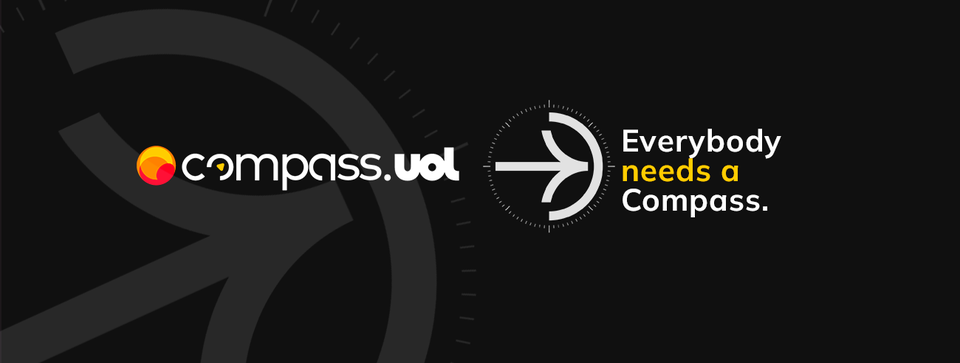

<a href="https://compass.uol/pt/home/?utm_source=google-ads&utm_medium=ppc&utm_campaign=compasso-uol-institucional&utm_term=compass%20uol&gclid=Cj0KCQiA8t2eBhDeARIsAAVEga0psEnDoNWT4VpWMzuImp4AOtzXNza6-2BjcW4NhikaYVwWlSz8DcIaAqvXEALw_wcB"></a>

<h1 align="center">Programa de Bolsas Compass Uol - Data & Analytics</h1>

<p align="center"> Repositório para armazenar anotações e códigos criados ao longo do programa.</p>

<p align="center">
 <a href="#sobre">Sobre o programa</a> •
 <a href="#conteudos">Conteúdos estudados</a> •
 <a href="#certificados">Certificados</a> •
 <a href="#desafio">Desafio final</a> •
 <a href="#autor">Autor</a>
</p>

<br>

<a id="sobre"></a>
## 📝 Sobre o programa

É uma iniciativa da Compass Uol, que visa a formação de pessoas dentro da cultura da empresa e descoberta de novos talentos. Com duração de 5 meses, remotamente e seguindo a metodologia Scrum, os participantes dispõem de 4h semanais para realizar cursos e projetos práticos com o auxílio da plataforma Udemy

<br>

<a id="conteudos"></a>
## 📚 Conteúdos do programa

### Introdução 
- [ ] Segurança em Aplicações WEB
- [x] Metodologia Ágil

### [Sprint 1](/sprint1) 
- [x] Git e GitHub
- [x] Sistemas GNU/Linux 
- [x] Exercício 1.0

### [Sprint 2](/sprint2) 
- [x] Conceitos da área de dados
- [x] SQL
- [x] Big Data
- [x] Exercício 2.0
- [x] Exercício 2.1

### [Sprint 3](/sprint3) 
- [x] Python
- [x] Exercício 3.0

### [Sprint 4](/sprint4) 
- [x] Programação funcional
- [x] Python
- [x] Docker
- [x] Estatística descritiva
- [x] Exercício 4.0

### [Sprint 5](/sprint5/) 
- [x] Computação em núvem (AWS)

### [Sprint 6](/sprint6/) 
- [x] Computação em núvem (AWS)
- [x] Exercício 6.0

### [Sprint 7](/sprint7/) 
- [x] Apache Hadoop
- [x] Apache Spark
- [x] Exercício 7.0

### [Sprint 8](/sprint8/) 
- [x] Apache Spark Batch
- [x] Exercício 8.0

### [Sprint 9](/sprint9/) 
- [x] Exercícios 9.0

### Sprint 10 
- [ ] AWS QuickSight
- [ ] Workshop QuickSight
- [ ] Exercício 10.0

<br> 

<a id="certificados"></a>
## 🗂️ Certificados

<a href="/certificados">Acesse os certificados obtidos durante o programa</a>

<br>

<a id="desafio"></a>
## 📊 Desafio final

Desde a sprint 8 trabalhamos em nosso desafio final em paralelo aos estudos. É um desafio que une os conteúdos estudados na prática e demonstra que realmente aprendemos.

Acesse meu desafio final: [**Melhores e piores animações da Disney lançadas no século 21**](/desafio/)

<br>

<a id="autor"></a>
##  👩‍💻 Autor

 

```SQL
SELECT * FROM tbtaissa
```

| Nome | Sobrenome | Idade | Cidade | Estado 
|--- |--- |--- |--- |---
| Taissa | Silva | 20 | União da Vitória | PR 

<br>

```SQL
SELECT * FROM tbeducacao
```

| Código | Instituicao de ensino | Curso | Status | Semestre | Ano de conclusão 
|--- |--- |--- |--- |--- |---
| 1 | Instituto Federal do Paraná | Técnico em informática | Concluído | 0 | 2021
| 2 | Unicesumar | Análise e desenvolvimento de sistemas | Cursando | 4 | 2023

<br>

```SQL
SELECT * FROM tbtecnologias
```

| Código | Nome | Conhecimento 
|--- |--- |---
| 1 | C | Básico
| 2 | Pyhton | Básico
| 3 | Java | Básico
| 4 | SQL | Intermediário
| 5 | HTML | Básico
| 6 | CSS | Básico
| 7 | Javascript | Básico
| 8 | Git | Intermediário

<br>

```SQL
SELECT * FROM tbhobbies
```

| Código | Hobbie
|--- |---
| 1 | Ouvir música 
| 2 | Ler
| 3 | Assistir
| 4 | Ficar com animais de estimação

<br>

```SQL
SELECT * FROM tbcontato
```
| Código | Nome | Link
|--- |--- |---
| 1 | Linkedin | [](https://www.linkedin.com/in/taissa-silva-39a4171b5/) 
| 2 | Gmail | [](mailto:staissa002@gmail.com)
| 3 | Outlook Corporativo | [](mailto:taissa.silva.pb@compasso.com.br)
| 4 | Whatsapp | [_98801--0516-25D366?style=flat-square&logo=whatsapp&logoColor=white)](https://wa.me/42988010516)
