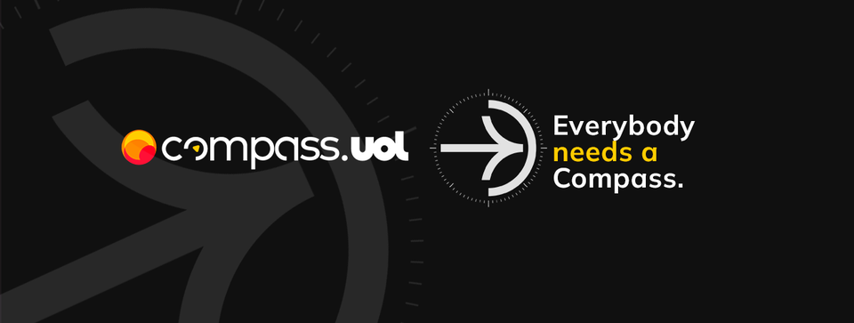

<h1 align="center">Programa de Bolsas Compass Uol - Data & Analytics</h1>

 Repositório para armazenar anotações e códigos criados ao longo do programa.

 <a href="#sobre">Sobre o programa</a> •
 <a href="#conteudos">Conteúdos estudados</a> •
 <a href="#autor">Autor</a>

## 📝 Sobre o programa

>É uma iniciativa da Compass Uol, que visa a formação de pessoas dentro da cultura da empresa e descoberta de novos talentos. Com duração de 5 meses, remotamente e seguindo a metodologia Scrum, os participantes dispõem de 4h semanais para realizar cursos e projetos práticos com o auxílio da plataforma Udemy

## 📚 Conteúdos do programa

### Introdução 
- [ ] Segurança em Aplicações WEB
- [ ] Metodologia Ágil

### Sprint 1 
- [x] Git e GitHub
- [x] Sistemas GNU/Linux 
- [x] Exercício 1.0

### Sprint 2 
- [ ] Conceitos da área de dados
- [ ] SQL
- [ ] Big Data
- [ ] Exercício 2.0
- [ ] Exercício 2.1

### Sprint 3 
- [ ] Python
- [ ] Exercício 3.0

### Sprint 4 
- [ ] Programação funcional
- [ ] Python
- [ ] Docker
- [ ] Estatística descritiva
- [ ] Exercício 4.0

### Sprint 5 
- [ ] Computação em núvem (AWS)
- [ ] Exercício 5.0

### Sprint 6 
- [ ] Computação em núvem (AWS)
- [ ] Exercício 6.0

### Sprint 7 
- [ ] Arquitetura Lambda
- [ ] Apache Hadoop
- [ ] Apache Spark
- [ ] Exercício 7.0

### Sprint 8 
- [ ] Apache Spark Batch
- [ ] Exercício 8.0

### Sprint 9 
- [ ] Apache Spark Streaming

### Sprint 10 
- [ ] Data Warehouse
- [ ] Visualização de dados
- [ ] Exercício 10.0
- [ ] Exercício 10.1

<a> id="autor"</a>
##  👩‍💻 Autor

#### [Taissa Silva](https://github.com/sTaissa)

 

